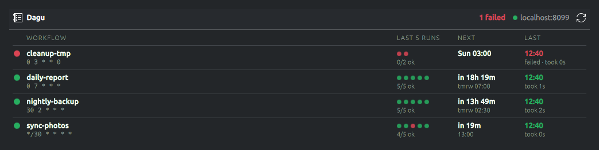

# dagu-plasma

A KDE Plasma 6 widget for [Dagu](https://github.com/dagu-org/dagu) workflows: what is
scheduled, when it runs next, and how the last runs went.



## What it shows

| Column | Line 1 | Line 2 |
|---|---|---|
| Workflow | name, with a status dot | cron schedule |
| Last N runs | one dot per run, oldest left | `4/5 ok` |
| Next | countdown (`in 19m`) or day and time | clock time of the next run |
| Last | when the last run started | status and duration |

- **Header**: the dot next to the server is green when Dagu answers, red when it doesn't.
  Failed workflows are counted next to it.
- **Hover** NEXT for the schedule, the next runs and each step's command; hover LAST for
  the run's steps with the tail of their stdout and stderr; hover a history dot for that
  run's status and time.
- **Click** a row to open the workflow in the Dagu web UI, or LAST to open that run.
- **Right-click** a row for *Run now*, *Stop* and *Open last run log*, or anywhere for
  *Configure*, *Open Dagu* and *Refresh*.
- **Notifications** when a run fails.
- **In a panel** it is an icon with a status dot: green all OK, red a run failed, blue
  something running, grey Dagu unreachable. Click it for the list.

Next runs are computed locally from the cron expressions (5 fields: `*`, `n`, `a-b`,
`a,b`, `*/n`, `a/n`); `@daily`-style shorthands show without a next run.

## Install

Needs KDE Plasma 6.

```bash
git clone https://github.com/marosmars/dagu-plasma.git
cd dagu-plasma
./install.sh                              # install, or upgrade an existing install
plasmawindowed org.maros.daguwidget       # optional: try it in a window
```

Then right-click the desktop or a panel → *Add Widgets…* → **Dagu Workflows**.

After an upgrade, Plasma keeps running the old version until it restarts:
`systemctl --user restart plasma-plasmashell`.

## Settings

Right-click the widget → *Configure Dagu Workflows…*

| Setting | Default |
|---|---|
| Dagu server URL | `http://localhost:8085` |
| Authentication | none (or username + password, or API token) |
| Refresh interval | 30 s |
| Workflows to show | all |
| Sort by | name (or next run, or failures first) |
| Run history dots | 5 (0 hides the column) |
| Compact layout (one line per workflow) | off |
| Show cron schedule / last run duration | on / on |
| Time format | 24-hour |
| Notify when a run fails | on |

### Authentication and HTTPS

For a Dagu server with basic auth or API tokens, pick the mode and enter the username,
password or token. The password or token is stored in **KWallet** (folder `dagu-plasma`),
never in the Plasma config, and sent as an `Authorization` header with every request.
If Dagu rejects it, the widget says so instead of reporting the server as unreachable.

HTTPS certificates are verified normally. For a self-signed certificate, add it to the
system trust store (for example `/usr/local/share/ca-certificates/` and
`sudo update-ca-certificates`).

## Development

```bash
node --test 'test/*.test.mjs'    # unit tests for the cron parser and formatting helpers
```

| Path | What |
|---|---|
| `package/contents/code/cron.js` | cron parser and next-run calculation |
| `package/contents/code/format.js` | API response mapping, labels, tooltips, auth headers |
| `package/contents/ui/main.qml` | polling, menus, notifications, panel icon |
| `package/contents/ui/DagRow.qml` | one workflow row (also the column header) |
| `package/contents/ui/Wallet.qml` | KWallet access over D-Bus |
| `package/contents/ui/configGeneral.qml` | settings page |

The JS files are QML libraries (`.pragma library`); `test/load.mjs` loads them into Node.

Uses the Dagu v2 REST API: `GET /api/v2/dags`, `GET /api/v2/dags/{name}`,
`GET /api/v2/dags/{name}/dag-runs`, `GET /api/v2/dag-runs/{name}/{id}/steps/{step}/log`,
`POST /api/v2/dags/{name}/start` and `POST /api/v2/dags/{name}/stop-all`.
Tested with Dagu 1.30 on Plasma 6.6.

## License

MIT
